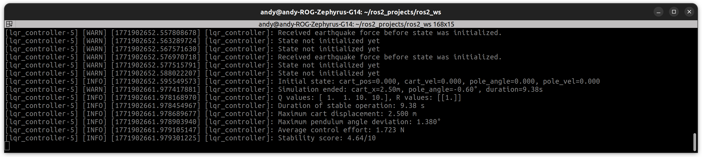
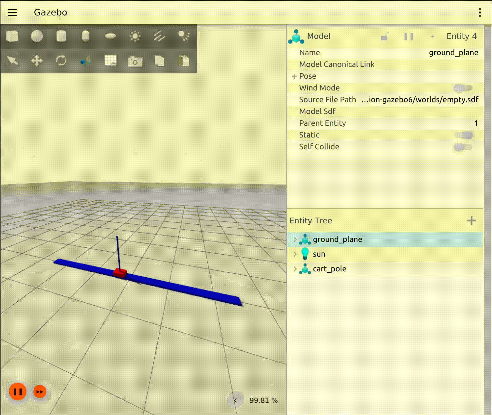
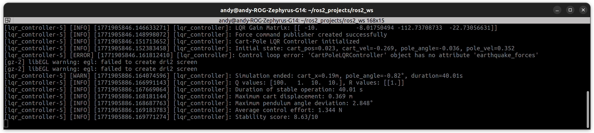
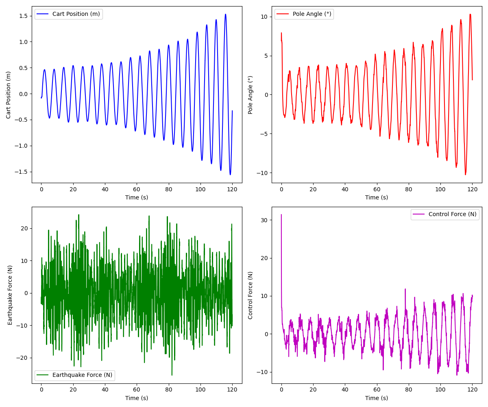
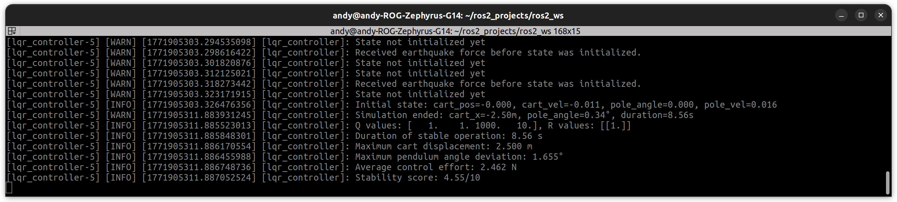
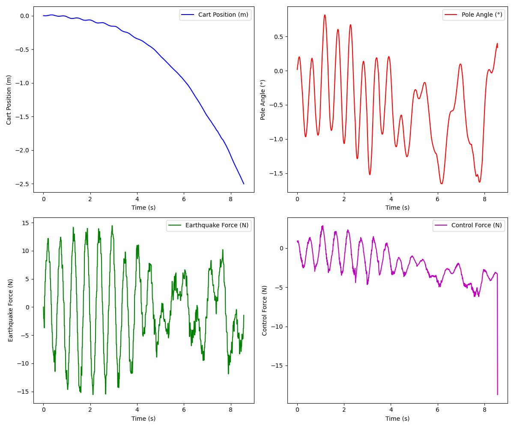
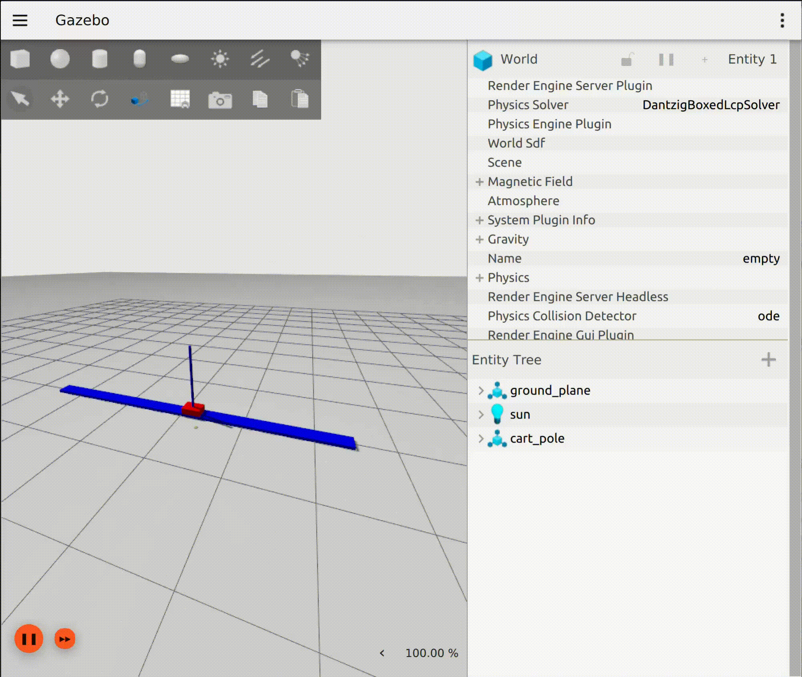
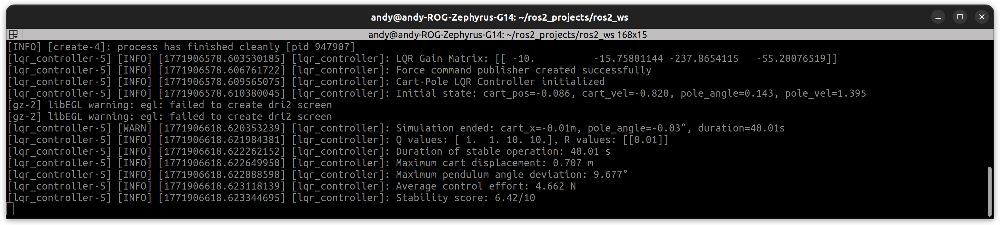
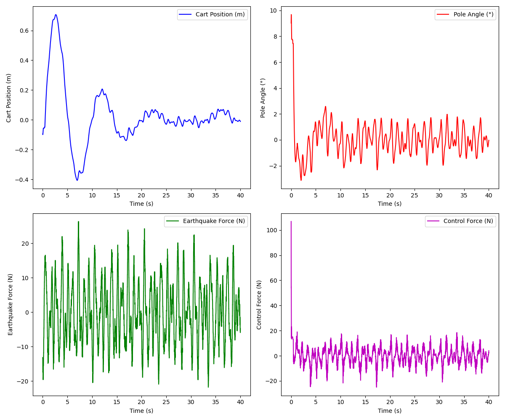
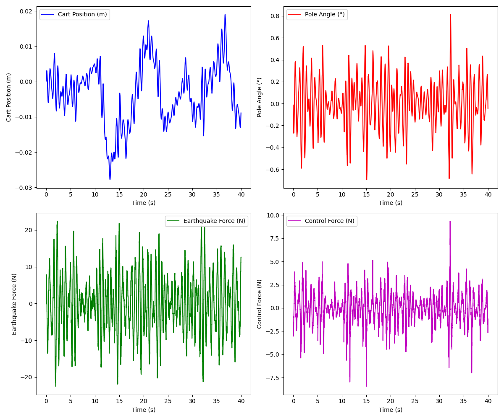

# Cart-Pole LQR Optimal Control

**Author:** Andy Tsai  
**Course:** SES 598 – Space Robotics and AI (Spring 2026)

---

## Overview

This project analyzes and tunes a **Linear Quadratic Regulator (LQR)** controller for an inverted cart-pole system subject to earthquake disturbances.

The objectives are:

- Stabilize the pole in the upright position  
- Keep the cart within ±2.5 m physical constraints  
- Maintain stable behavior under external disturbances  

A systematic **one-parameter-at-a-time scaling strategy** is used to isolate the effects of each LQR weight in the Q and R matrices.

---

## System Model

The state vector is defined as:

$$
x = \begin{bmatrix} x \\ \dot{x} \\ \theta \\ \dot{\theta} \end{bmatrix}
$$

$$
u = -Kx
$$

Where $x$ is the state vector and $u$ is the control input (cart force) at time $t$.

The LQR controller minimizes the following cost function:

$$
J = \int_{0}^{\infty} (x^T Q x + u^T R u) dt
$$


### Weighting Matrices

The performance of the controller is tuned using the $Q$ and $R$ matrices:

**State Weighting Matrix ($Q$):** Penalizes state deviations from the equilibrium.

$$
Q = \begin{bmatrix} q_x & 0 & 0 & 0 \\ 0 & q_{\dot{x}} & 0 & 0 \\ 0 & 0 & q_{\theta} & 0 \\ 0 & 0 & 0 & q_{\dot{\theta}} \end{bmatrix} = \begin{bmatrix} q_1 & 0 & 0 & 0 \\ 0 & q_2 & 0 & 0 \\ 0 & 0 & q_3 & 0 \\ 0 & 0 & 0 & q_4 \end{bmatrix}
$$

* $q_1, q_2$: Weights for cart position and velocity.
* $q_3, q_4$: Weights for pendulum angle and angular velocity.

**Control Weighting Matrix ($R$):** Penalizes the control effort.

$$
R = [\rho] = [r]
$$

---

## Package Structure

```text
cartpole_control/
├── cart_pole_optimal_control/
├── config/
├── launch/
├── media/
│   ├── default_params/
│   ├── 100x_q1/
│   ├── 100x_q3/
│   ├── 0.01x_r1/
│   └── optimal_params/
├── models/
├── resources/
├── rviz/
├── test/
├── README.md
├── assignment_details.md
├── package.xml
├── setup.cfg
└── setup.py
```

Each folder under `media/` contains:

- `plots.png` – Results Plots 
- `sim.gif` – Simulation 
- `terminal_log.png` – Terminal output


---

## Baseline (Default settings)

**Parameters**
```text
Q = diag([1.0, 1.0, 10.0, 10.0])    # State Cost
R = [[1.0]]                         # Control Cost
```

**Performance and Result**
- Duration: **9.38 s**
- Max cart displacement: **2.50 m** (hit the ±2.5 m limit)
- Max pole angle deviation: **1.38°**
- Avg control effort: **1.723 N**
- Stability score: **4.64 / 10**

<p align="center">
  
  
  
</p>

**Brief Summary**
The default LQR cannot either keep the pole straight upward (pole angle $\theta$ is not stable) or regulate cart position well ($x \not\approx 0$) under earthquake disturbances, which makes the cart drift and reach the boundary early.

---

## Tuning Strategy

From physical intuition:

- Cart position (q1) affects boundary constraint enforcement: Keep the cart's position near $x=0$. 
- Pole angle (q3) is most critical for stability: Keep the pole straight up. 
- Control cost (r1) affects aggressiveness  

Experiments performed:

1. 100× q1  
2. 100× q3  
3. 0.01× r1
4. Optimal parameters ()

Each parameter was scaled independently to isolate behavior changes.

---

## Running the Simulation

Run the simulation in Gazebo
```bash
ros2 launch cart_pole_optimal_control cart_pole.launch.py
```

Tune the force to the cartpole system

```bash
ros2 launch cart_pole_optimal_control cart_pole_rviz.launch.py
```

---

## Experiment 1 — 100× q1

**Parameters**
```text
Q = diag([100.0, 1.0, 10.0, 10.0])  
R = [[1.0]]
```
**Performance and Result**
- Duration: **40.01 s**
- Max cart displacement: **0.369 m**
- Max pole angle deviation: **2.848°**
- Avg control effort: **1.344 N**
- Stability score: **8.63 / 10**

<p align="center">
  
  
  
</p>

**Brief Summary**
Increasing $q_1$ significantly strengthens cart position regulation, keeping the cart close to the center and allowing the system to remain stable for the full simulation duration. However, both the cart position error and pole angle oscillations become larger compared to the baseline.

---

## Experiment 2 — 100× q3

**Parameters**
```text
Q = diag([1.0, 1.0, 1000.0, 10.0])  
R = [[1.0]]
```
**Performance and Result:**
- Duration: **8.56 s**
- Max cart displacement: **2.50 m** (hit the ±2.5 m limit)
- Max pole angle deviation: **1.655°**
- Avg control effort: **2.462 N**
- Stability score: **4.55 / 10**

<p align="center">
  
  
  
</p>

**Brief Summary**
Increasing \(q_3\) significantly strengthens pole-angle regulation, keeping the stick upright throughout the simulation. However, cart position is no longer well regulated, and the cart drifts until it reaches the ±2.5 m boundary. The controller prioritizes minimizing \(\theta\) error over maintaining \(x \approx 0\), leading to early termination despite good angle stability.


---

## Experiment 3 — 0.01× r1

**Parameters**
```text
Q = diag([1.0, 1.0, 10.0, 10.0])  
R = [[0.01]]
```

**Performance and Result**
- Duration: **40.01 s**
- Max cart displacement: **0.707 m**
- Max pole angle deviation: **9.677°**
- Avg control effort: **4.662 N**
- Stability score: **6.42 / 10**
<p align="center">
  
  
  
</p>

**Brief Summary**
Reducing \(R\) matrix makes control effort cheap, allowing the controller to react aggressively to disturbances and keep the cart near \(x \approx 0\) for the full simulation duration. However, this leads to strong oscillations and large pole-angle deviations, with significant control-force spikes. The system remains stable overall, but the response is much less smooth.

---

## Optimal Parameters

```text
Q = diag([1.0, 1.0, 100.0, 10.0]) 
R = [[0.01]]     
```
**Performance and Result**
- Duration: **40.01 s**
- Max cart displacement: **0.028 m**
- Max pole angle deviation: **0.812°**
- Avg control effort: **1.133 N**
- Stability score: **9.73 / 10**

<p align="center">
  
  
  
</p>

**Brief Summary**
This configuration achieves the best overall balance between cart regulation and pole stabilization. The cart remains tightly controlled around \(x \approx 0\), while the pole angle stays within a very small deviation despite strong earthquake disturbances. By increasing the pole-angle weight and reducing the control penalty, the controller becomes responsive enough to reject disturbances without introducing excessive oscillations, resulting in the highest stability score among all experiments.

---


## Notes

* All plots are generated automatically and saved as PNG files
* Experiments are fully reproducible using the provided launch files

---

## License

For academic use only (course assignment).
