# First-Order Boustrophedon Navigator (ROS 2 Turtlesim)

**Author:** Andy Tsai
**Course:** SES 598 – Space Robotics and AI (Spring 2026)

---

## Overview

This project implements and tunes a **first-order PD controller** to generate a **boustrophedon (lawnmower) coverage pattern** in ROS 2 using `turtlesim`.
The goal is to achieve **uniform coverage**, **smooth motion**, and **low cross-track error (CTE)** by systematically tuning controller gains and the path spacing parameter.

All experiments follow a **one-parameter-at-a-time** tuning strategy to clearly isolate the effect of each parameter.

Details of this assignment can be found in [assginment_details](./assignment_details.md).
Report for this assignment can be found in [Assignment_1](./media/report/Assignment_1.pdf).

---

## Key Components

* **PD Controller** for linear and angular velocity
* **Boustrophedon path generator** (waypoint-based)
* **Performance evaluation** using:

  * Cross-track error (average & max)
  * Trajectory visualization
  * Velocity profiles (`rqt_plot`)

---

## Package Structure

```text
first_order_boustrophedon_navigator/
├── config/                 # Parameter YAML files
├── launch/                 # ROS 2 launch files
├── scripts/                # Controller and helper scripts
├── resource/               # ROS package resources
├── media/                  # Experiment results (organized by parameter setting)
│   ├── default_params/
│   ├── 10xKp_linear/
│   ├── 10xKd_linear/
│   ├── 10xKp_angular/
│   ├── 10xKd_angular/
│   ├── 2xSpacing/
|   ├── optimal_params/
│   └── real_time_inspection.png
├── README.md
├── package.xml
└── setup.py
```

Each folder under `media/` contains:

* `path.png` – TurtleSim trajectory
* `rqt_plot.png` – Pose and velocity plots
* `cross_track_error.png` (when applicable)

This structure enables **direct visual comparison** across experiments.

---

## Default Parameters (Baseline)

```text
Kp_linear   = 1.0
Kd_linear   = 0.1
Kp_angular  = 1.0
Kd_angular  = 0.1
spacing     = 0.5
```

#### Baseline performance and Result:
Large errors occur primarily during <b>turns and line transitions</b>, motivating gain tuning.

* Average CTE ≈ **0.996**
* Maximum CTE ≈ **2.111**

<p align="center">
  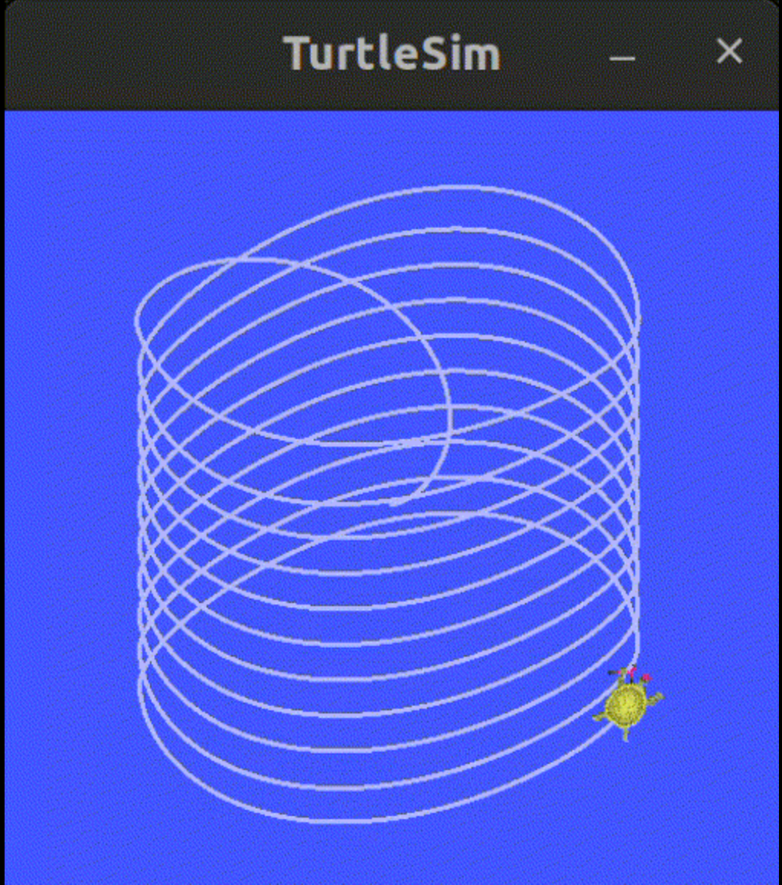
  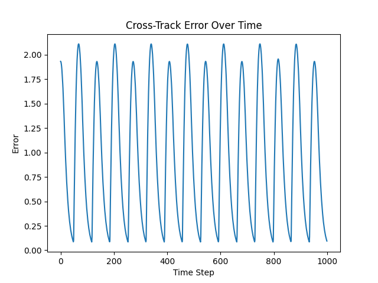
  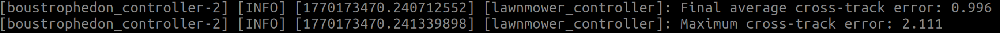
  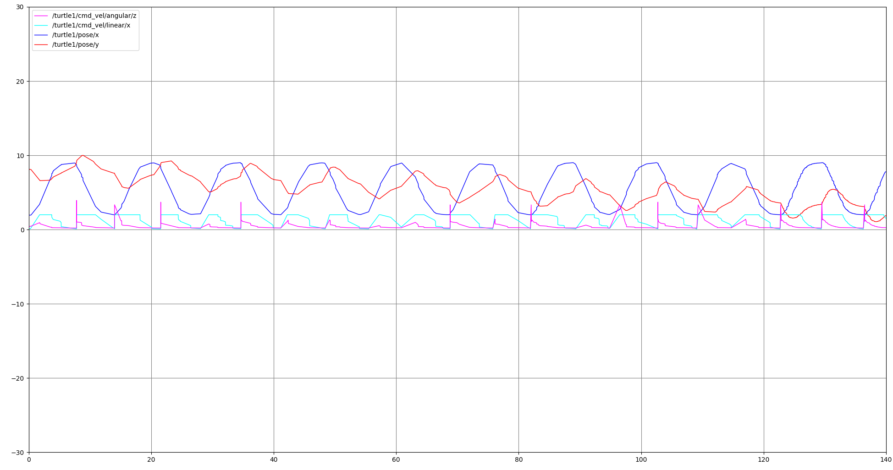
</p>

---

## Tuning Methodology

1. Tune **PD gains first** (controller stability)
2. Adjust **spacing last** (path geometry)
3. Scale one parameter at a time (e.g., `10xKp_angular`)
4. Evaluate using trajectory shape, CTE, and velocity signals

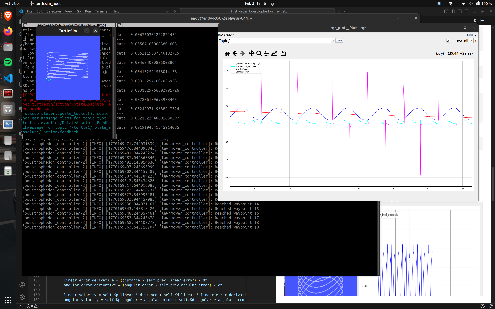
---

## Gain Interpretation (from Experiments)

* **Kp_linear**: Determines whether and how strongly the turtle reaches waypoints
* **Kd_linear**: Controls oscillation near waypoints (damping)
* **Kp_angular**: Controls turning sharpness and heading correction
* **Kd_angular**: Damps angular oscillations during cornering

Excessive gains consistently lead to oscillation or unstable behavior.

---

## Optimal Parameters

```text
Kp_linear   = 1.2
Kd_linear   = 0.02
Kp_angular  = 9.0
Kd_angular  = 0.03
spacing     = 0.5
```

#### Final performance and Result:
The turtle follows a clean and uniform lawnmower pattern with stable turns.

* Average CTE ≈ **0.061**
* Maximum CTE ≈ **0.180**

<p align="center">
  
  
  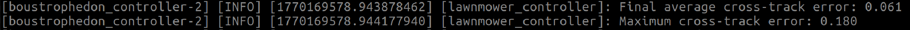
  
  
</p>


---

## Running the Project

```bash
ros2 launch first_order_boustrophedon_navigator boustrophedon.launch.py
```

Optional visualization:

```bash
rqt_plot /turtle1/pose/x /turtle1/pose/y \
         /turtle1/cmd_vel/linear/x /turtle1/cmd_vel/angular/z
```

---

## Results Summary

Below are visual demonstrations of how different parameter settings affect the robot behavior. Each animation shows the TurtleSim trajectory under a specific configuration.


### High Angular Gains

* **10xKp_angular**: Sharper turns with visible oscillations.
<p align="center">
  
  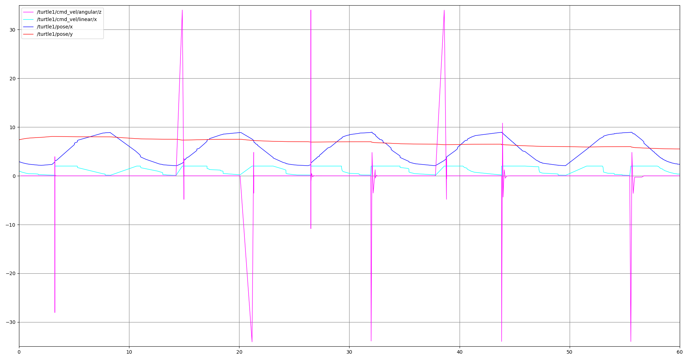
</p>

* **10xKd_angular**: Excessive damping leading to unstable oscillatory motion.

<p align="center">
  
  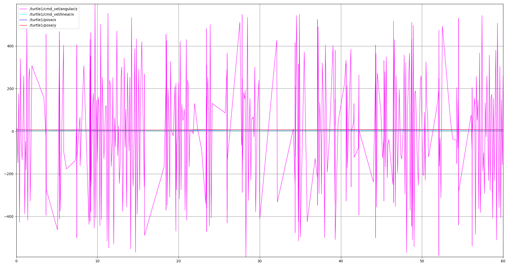
</p>

### High Linear Gains

* **10xKp_linear**: Failure to converge to the first waypoint.

<p align="center">
  
  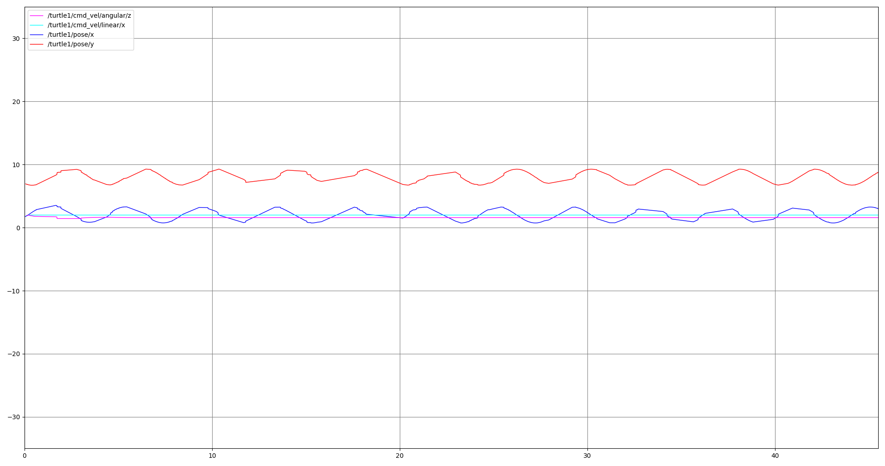
</p>

* **10xKd_linear**: Oscillations near waypoints and distorted path tracking.

<p align="center">
  
  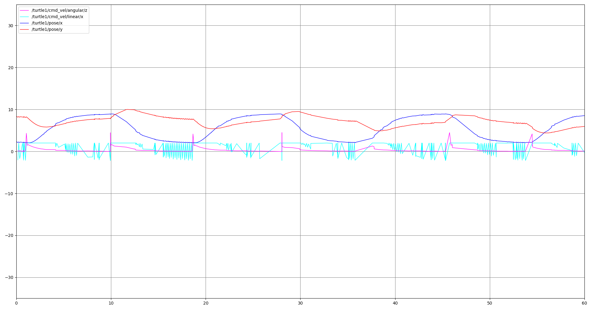
</p>

### Spacing Effect
**2xSpacing**: Wider coverage pattern with similar controller behavior as optimal parameters but not necessarily lower average error.
* Average CTE ≈ **0.063**
* Maximum CTE ≈ **0.176**

<p align="center">
  
  
  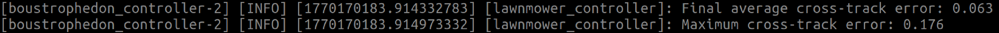
  
</p>


---

## Notes

* All plots are generated automatically and saved as PNG files
* Experiments are fully reproducible using the provided launch files

---

## License

For academic use only (course assignment).
